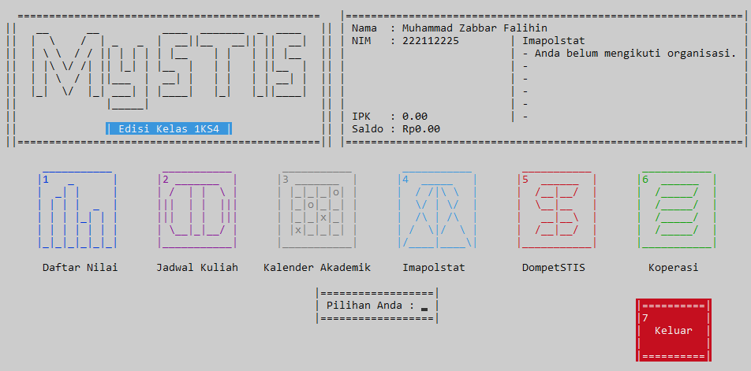
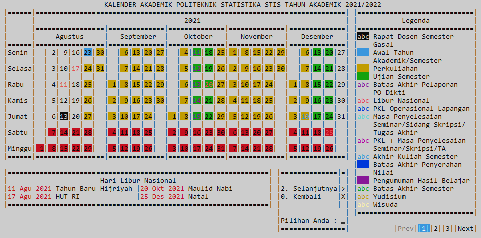

# MySTIS - Tugas Akhir Mata Kuliah Algoritma dan Pemrograman

###### **Repository ini berisi Tugas Akhir dengan Bahasa Pemrograman Pascal untuk Mata Kuliah Algoritma dan Pemrograman.**

  

 

  

 

## Anggota Kelompok 1

1. Muhammad Zabbar Falihin
2. Fauziah Filda Mufarrihati
3. Muhammad Fauzan Azima. A
4. Yanuar Nurul Hilal

## Deskripsi Program

Program yang kami buat adalah aplikasi kemahasiswaan yang kami beri nama "MySTIS." Aplikasi ini dirancang untuk membantu kehidupan mahasiswa dengan menyediakan beberapa fitur penting, antara lain:

- Perhitungan IPK: Aplikasi ini memungkinkan pengguna untuk menghitung Indeks Prestasi Kumulatif (IPK) mereka dengan mudah. Dengan memasukkan nilai dan bobot mata kuliah, pengguna dapat melacak IPK mereka selama masa kuliah.

- Jadwal Kuliah: MySTIS juga memiliki fitur jadwal kuliah yang memungkinkan pengguna untuk menyimpan dan mengelola jadwal kuliah mereka. Ini membantu mahasiswa menjaga keteraturan dan menghindari bentrok jadwal.

- Kalender Akademik: Aplikasi ini menyediakan kalender akademik dengan tanggal-tanggal penting seperti tanggal pendaftaran, ujian, dan liburan akademik. Ini membantu mahasiswa untuk tetap terorganisir selama studi mereka.

- Perhitungan Saldo dan Belanja: MySTIS juga dapat digunakan untuk mengelola keuangan mahasiswa. Pengguna dapat memasukkan pemasukan dan pengeluaran mereka untuk melacak saldo dan mengatur anggaran.

- Organisasi Kemahasiswaan: Aplikasi ini juga memiliki fitur untuk organisasi kemahasiswaan, seperti mencatat pertemuan, tugas, dan acara organisasi.

## Cara Menggunakan Program

1. Pastikan Anda memiliki kompiler Pascal yang terinstal di komputer Anda.
2. Salin kode program yang ada ke dalam berkas Pascal yang baru.
3. Kompilasi dan jalankan program menggunakan kompiler Pascal Anda.
4. Ikuti instruksi yang muncul di layar untuk menggunakan berbagai fitur MySTIS.

Selamat mencoba MySTIS! Kami harap aplikasi ini dapat membantu Anda dalam kehidupan mahasiswa Anda. Jika Anda memiliki pertanyaan atau masukan, jangan ragu untuk menghubungi kami melalui kontak yang tertera di profil kami.

Terima kasih telah menggunakan MySTIS.
